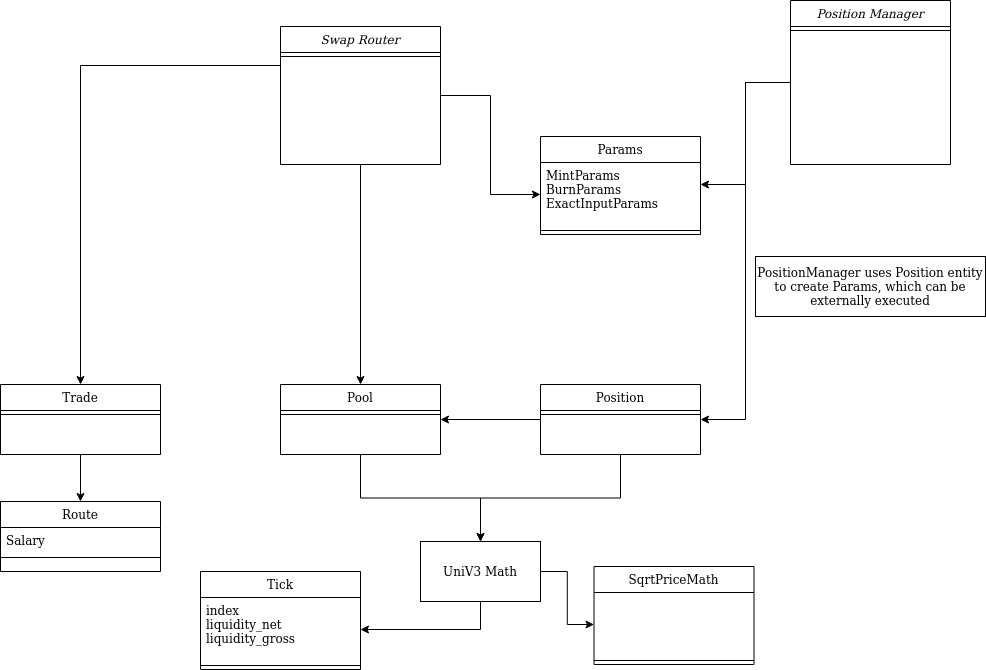

# UniswapV3 Python Client

A python client for interacting with UniswapV3. It supports swapping, and position management. This client is build upon the Pymaker framework.

THIS SOFTWARE IS AN ALPHA STATE AND SHOULD BE USED WITH EXTREME CAUTION.

## Guides
Interacting with pool, router, and if deploying a new pool, factory contracts.
- Pool: https://github.com/Uniswap/uniswap-v3-core/blob/main/contracts/UniswapV3Pool.sol
- NonfungiblePositionManager: https://github.com/Uniswap/uniswap-v3-periphery/blob/main/contracts/NonfungiblePositionManager.sol
- SwapRouter: https://github.com/Uniswap/uniswap-v3-periphery/blob/main/contracts/SwapRouter.sol
- Quoter: https://github.com/Uniswap/uniswap-v3-periphery/blob/main/contracts/lens/Quoter.sol
- TickLens: https://github.com/Uniswap/uniswap-v3-periphery/blob/main/contracts/lens/TickLens.sol

Documentation is available here: https://docs.uniswap.org/concepts/V3-overview/glossary

Pymaker repository is available here: https://github.com/makerdao/pymaker 

Helpful links:
- https://mellowprotocol.medium.com/uniswap-v3-liquidity-providing-101-f1db3822f16d

## Usage

Instantiate either `SwapRouter` or `PositionManager` entities that wrap the respective uniswap-v3-periphery contracts, passing in a Web3 provider that has private keys registered.

Methods on these classes return `pymaker.Transact` objects, which need to be invoked externally with a `.transact()` method call.

All calculations are performed on integers. When floats or percentages are expected, `uniswapv3_entities.Fraction` math operations are used instead. 

The EVM operates on wei amounts, so amount calculated use `pymaker.numeric.Wad` to convert between human readable, and EVM understandable terms. Inputs to methods like `Position.from_amounts()` or `Trade.from_route` are asuumed to be normalized for the given tokens decimals on call, and Wadified. This primarily comes into play when swapping, or calculating price. Otherwise liquidity management is largely decimal agnostic.

&nbsp;

**If managing liquidity:**
1. Construct a `Pool` object. You can either instantiate manually, or execute `position_manager.get_pool()`.
2. Construct a `Position` object. This requires setting the lower and upper ticks for the desired position. The tick range must be contiguous. Calculate the desired amount of liquidity to add using `Position.from_amounts()` or manually entering desired liquidity.
3. Pass the previously instantiate `Pool` and `Position` objects into the desired liquidity operation. In the case of adding liquidity, this would be`MintParams`.
4. Call the desired liquidity method in `PositionManager`, e.g. `position_manager.mint(mint_params).transact()`

An example script can be seen in: [manual_test_uniswapv3_liquidity_management.py](../tests/manual_test_uniswapv3_liquidity_management.py)

&nbsp;

**If executing swaps:**

1. Construct a `Pool` object. You can either instantiate manually, or execute `position_manager.get_pool()`.  
2. Build `Route` object. If the route will hop across multiple pools, call `swap_router.encode_route_to_path(route, <input/output>)`
3. Build `Trade` object from the previously instantiated `Route` object, along with the desired trade amount, and the type of trade.
4. Construct trade params, e.g. `ExactOutputParams` from the trade objects slippage adjusted swap amount calculations, and use as input to `SwapRouter` transact methods.

*The above steps utilize client side methods in `Trade` to calculate swap amounts which adjust for slippage on the client. You can also call the Quoter contract directly to get non slippage adjusted trade amounts.*

An example script can be seen in: [manual_test_uniswapv3_swap.py](../tests/manual_test_uniswapv3_swap.py)

&nbsp;

## Design

&nbsp;

### Future Improvements
- support permit
- Add oracle support
- check for token decimals -> require inputting Wad type numbers into amount calculations
  - Ensure all Wad conversion are done prior to calling functions
- improve tickList updating -> add capability for a data provider to calculate the effects of swaps on a pools ticks offchain
- Add unwrap WETH support
- Implement UniV3NFT class for interacting with position NFTs externally from PositionManager.
- Implement flashbot support

### Other Libraries
- https://github.com/Uniswap/uniswap-v3-sdk
- https://github.com/uniswap-python/uniswap-python
- https://github.com/thanpolas/univ3prices
